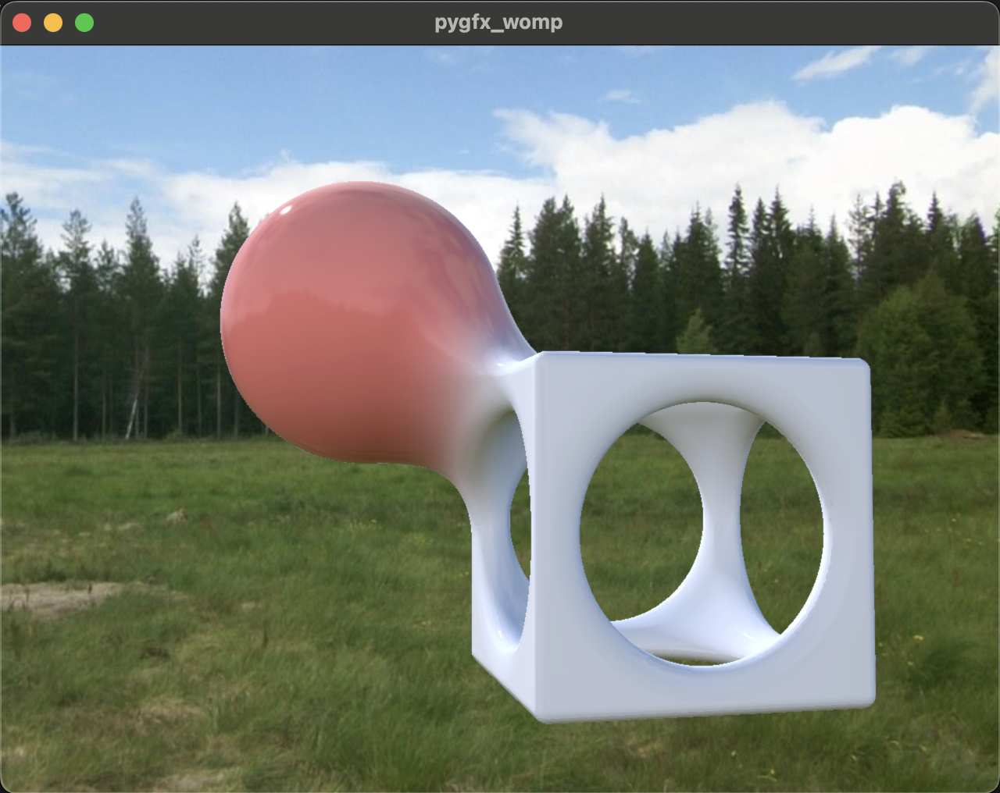

  
# quickstart
create a virtual environment  
`python3 -m venv venv`  

activate the virtual environment  
`source ./venv/bin/activate`  

install dependencies  
`pip install -r requirements`  

load up the model  
`python womp.py`  

# notes
I tried out latest `pygfx` that uses a different library to support loading `gltf` files but it didn't seem to work for model. I believe it is something wrong with the model itself. The `gltf` [validator](https://github.khronos.org/glTF-Validator/) doesn't like it. This is the `requirements.txt` file line that can be used for relevant commit:  
`pygfx @ git+https://github.com/pygfx/pygfx.git@9ac332b819fcc485e9ff318bb072785af669d480`